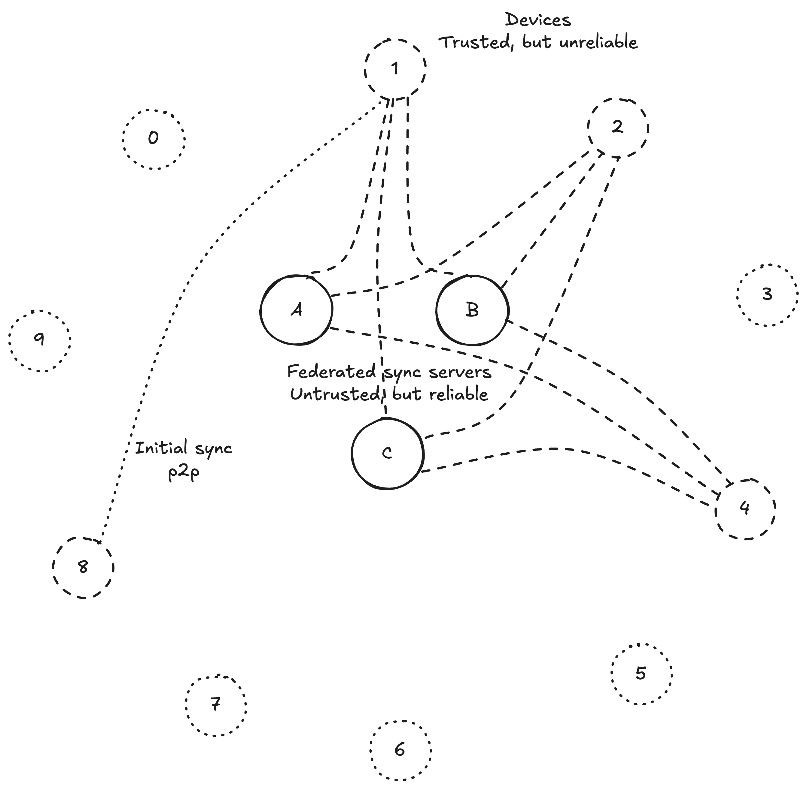
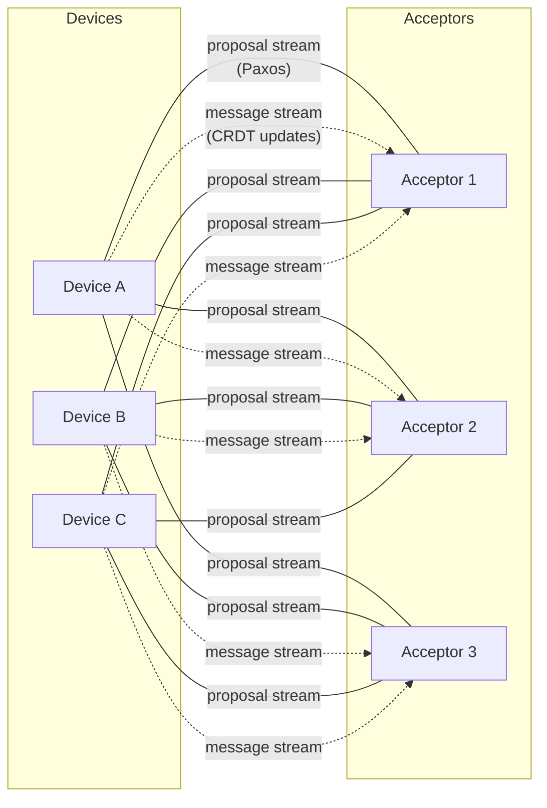
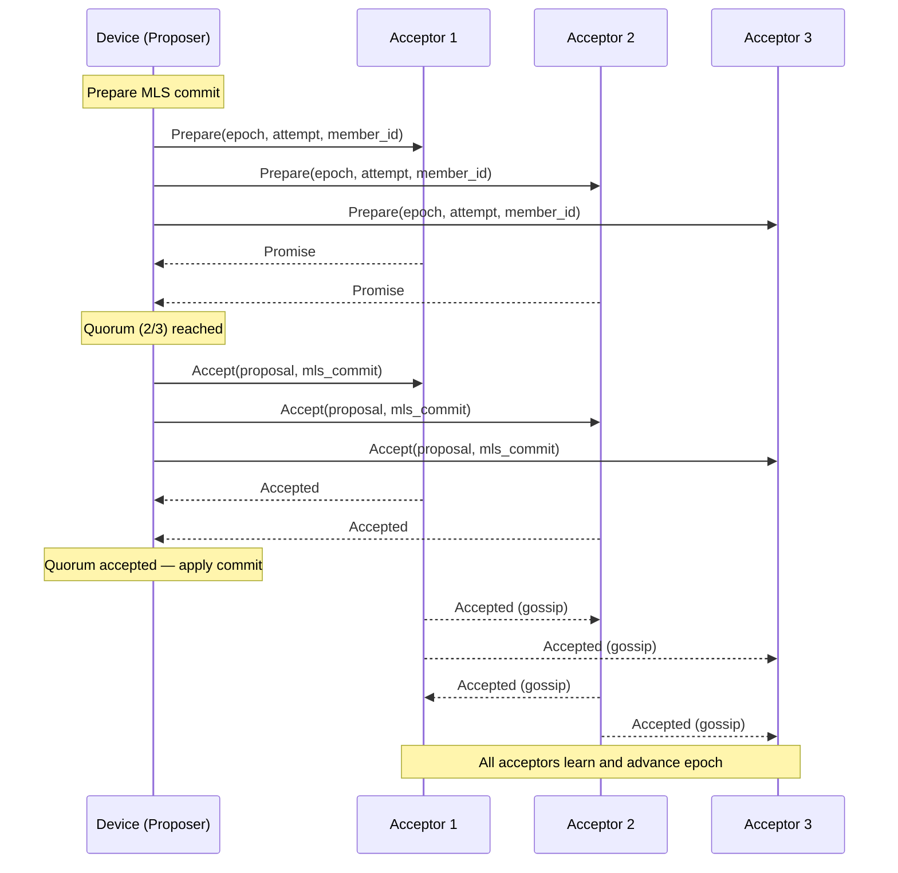
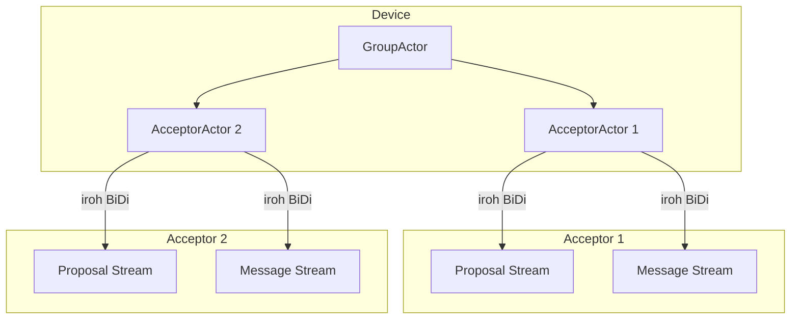
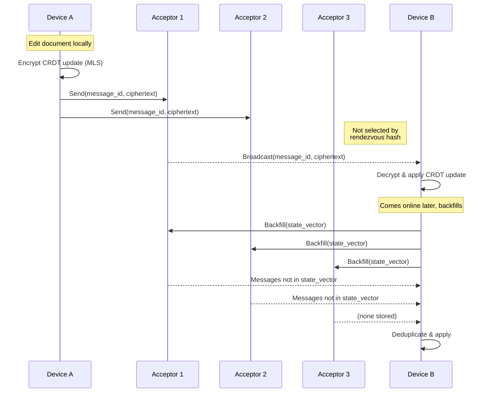
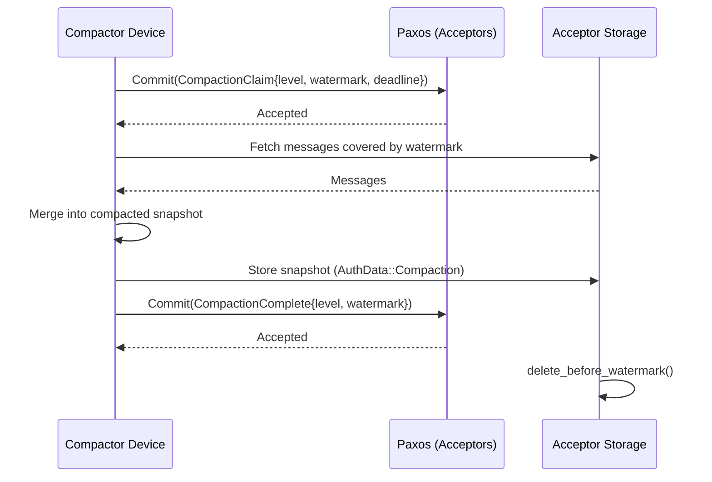

# universal-sync

Federated sync engine built on MLS, Paxos, iroh, and CRDTs.

Synchronise documents between multiple devices through a federated set of
untrusted servers, with end-to-end encryption and local-first editing.
Devices exchange encrypted CRDT updates through the servers; the shared
document is eventually consistent without the servers ever seeing its contents.

## Architecture

### Overview

Devices communicate through a small set of federated **acceptor** servers.
These servers are untrusted — they cannot read or forge messages — but are
expected to maintain availability and not withhold messages. Running multiple
servers under independent administrators makes availability and withholding
attacks impractical. Servers can be added or removed at any time.

All messages are signed and encrypted with MLS, providing forward secrecy and
post-compromise secrecy. The servers see group metadata (membership, timing)
but never message contents.

There are two classes of messages with different delivery paths:

- **Application messages** (CRDT updates) are local-first. They bypass
  consensus and are routed to a subset of acceptors for storage. They can be
  sent and received asynchronously, including while offline.
- **Commits** (membership changes, key rotation, compaction) require global
  ordering. They go through Paxos consensus across all acceptors.

Solid lines: proposal streams (all acceptors). Dotted lines: message streams
(subset via rendezvous hashing).

### Crate structure

| Crate | Role |
|-------|------|
| `paxos` | Core Multi-Paxos state machines (pure + async runtime) |
| `sync-core` | Shared types, protocol messages, CRDT traits, MLS extensions |
| `sync-proposer` | Device/client library — group management, message routing |
| `sync-acceptor` | Server library — Paxos acceptor, message storage, backfill |
| `sync-testing` | Integration test harness |
| `sync-editor` | Tauri desktop editor application |

## MLS ([Messaging Layer Security](https://en.wikipedia.org/wiki/Messaging_Layer_Security))

MLS provides the group key agreement protocol. Each document has its own MLS
group. MLS handles:

- Encrypting and signing all messages (application messages and commits).
- Efficiently adding and removing members from the sync group.
- Epoch-based key rotation for forward secrecy.

Custom MLS extensions carry protocol-specific data:

| Extension / Proposal | Purpose |
|-----------------------|---------|
| `GroupContextExt` | CRDT type identifier and compaction config |
| `KeyPackageExt` | Member iroh address and supported CRDT types |
| `GroupInfoExt` | Current acceptor list and optional CRDT snapshot |
| `SyncProposal::AcceptorAdd` | Add an acceptor server to the group |
| `SyncProposal::AcceptorRemove` | Remove an acceptor server from the group |
| `SyncProposal::CompactionClaim` | Claim a compaction lease |
| `SyncProposal::CompactionComplete` | Mark compaction as finished |

## Paxos

MLS application messages work asynchronously, but MLS commits must be
processed in a globally consistent order. Paxos provides this serialisation.

**Roles:**

- **Proposers** — devices proposing a commit (add/remove member, update keys,
  compaction). Each device acts as an independent proposer; there is no leader
  election.
- **Acceptors** — the federated servers. They run the Paxos acceptor role,
  storing promises and accepted values. Quorum is `floor(n/2) + 1`.
- **Learners** — all devices and acceptors. They observe accepted commits and
  advance the MLS epoch.

**Ballot scheme:** `(Epoch, Attempt, MemberId)` with lexicographic ordering.
`MemberId` is the MLS leaf index, guaranteed unique within the group.

Every round requires two phases (Prepare → Promise, Accept → Accepted).
Multi-Paxos leader optimisation is explicitly disabled — every Accept must
match an exact prior Promise. Contention between concurrent proposers is
resolved by incrementing the attempt number and retrying.

Acceptor membership changes (`AcceptorAdd` / `AcceptorRemove`) are themselves
MLS custom proposals agreed through Paxos. Quorum size updates atomically
when the commit is applied.

## iroh

All network communication uses [iroh](https://www.iroh.computer/). Devices
connect to acceptor servers over iroh, which provides:

- NAT traversal and hole punching.
- Relay-based fallback transport.
- Multiplexed bidirectional streams.

Each device opens two streams per acceptor:

1. **Proposal stream** — bidirectional Paxos Prepare/Accept messages.
2. **Message stream** — application message send, subscribe, and backfill.

## CRDTs ([Conflict-free Replicated Data Types](https://en.wikipedia.org/wiki/Conflict-free_replicated_data_type))

Document changes are local-first. Edits happen offline and synchronise when
connectivity is restored. Since there is no global ordering of edits, CRDTs
ensure all devices converge to the same document state.

CRDT updates are MLS application messages. They are:

- Identified by `(MemberFingerprint, seq)` where `MemberFingerprint` is a
  SHA-256 of the sender's MLS signing key.
- Deduplicated on both the acceptor (storage key) and device (in-memory set).
- Tracked with a per-sender state vector for backfill.

### Message routing

Not every application message needs to reach every acceptor. Messages are
routed to `ceil(sqrt(n))` acceptors selected by rendezvous hashing
(Highest Random Weight). This distributes storage load while maintaining
deterministic routing — any device can compute which acceptors hold a given
message.

Devices connect to all acceptors and subscribe to live broadcasts plus
backfill, so they receive the full message set across all acceptors.

### Compaction

Over time, CRDT updates accumulate. Hierarchical LSM-style compaction merges
older updates into compressed snapshots. A device claims a compaction lease
via Paxos (`CompactionClaim`), merges the covered updates, stores the
compacted result as a new message with `AuthData::Compaction` metadata, and
finalises via `CompactionComplete`. Acceptors then delete the superseded
messages.

Compacted snapshots serve as catch-up points for offline or new devices —
they backfill the snapshot plus any updates after the compaction watermark.

## Acceptor storage

Acceptors use [fjall](https://github.com/fjall-rs/fjall) (an LSM-tree
storage engine) with the following keyspaces:

| Keyspace | Key | Value |
|----------|-----|-------|
| `promised` | `(group_id, epoch)` | Promised proposal |
| `accepted` | `(group_id, epoch)` | Accepted (proposal, message) |
| `groups` | `group_id` | GroupInfo bytes |
| `messages` | `(group_id, sender_fingerprint, seq)` | Encrypted application message |
| `epoch_rosters` | `(group_id, epoch)` | Historical roster snapshot |

All writes are fsynced before acknowledging. Historical commits are replayed
from epoch 0 on server restart.

## Trust model

| Property | Guarantee |
|----------|-----------|
| Message confidentiality | MLS encryption; acceptors cannot read contents |
| Message integrity | MLS signatures + AAD; acceptors cannot forge or reorder |
| Availability | Federated; quorum of acceptors required |
| Forward secrecy | MLS epoch-based key rotation |
| Post-compromise secrecy | MLS key rotation on commits |

Acceptors are untrusted for secrecy and integrity. They are semi-trusted for
availability — a colluding quorum can cause denial of service but cannot
compromise message contents. Metadata (group membership, message timing and
frequency) is visible to acceptors.

Members within a group are fully trusted.
